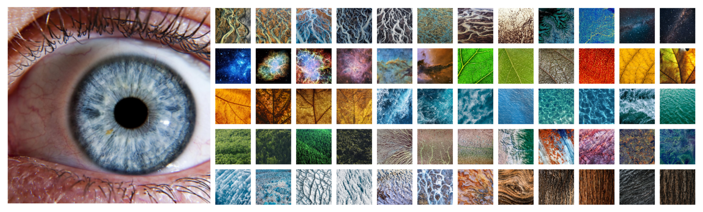

## Iskanje vzorca šarenice v naravi

Podrobne fotografije šarenice človeškega očesa razkrijejo fascinantne, dozdevno unikatne vzorce, ki se razlikujejo od posameznika do posameznika. Pa so ti vzorci res unikatni, ali se pojavljajo tudi drugot v naravi? V izvedeni nalogi poskusimo odgovoriti na to vprašanje z razvojem interaktivno aplikacije, ki zajame sliko subjektovega očesa in poišče fotografije podobnih naravnih struktur. Naloga je del širšega projekta Mojce Radkovič, magistrske študentke Novih medijev, ALUO. 




## Uporaba

### Priprava
pip install -r requirements.txt

### Zagon
Poženi aplikacijo s spletno kamero:
```
	python iris.py cam
```

Poženi aplikacijo z demo video posnetkom obraza:
```
	python iris.py video
```

Poženi aplikacijo z demo fotografijo obraza:
```
	python iris.py img
```

Poišči vzorce za vse slike šarenic v img_dir in shrani rezultat:
```
	python iris.py dir [img_dir]
```


Za podroben opis projekta, implementacije in rezultatov glej `report.pdf`.
